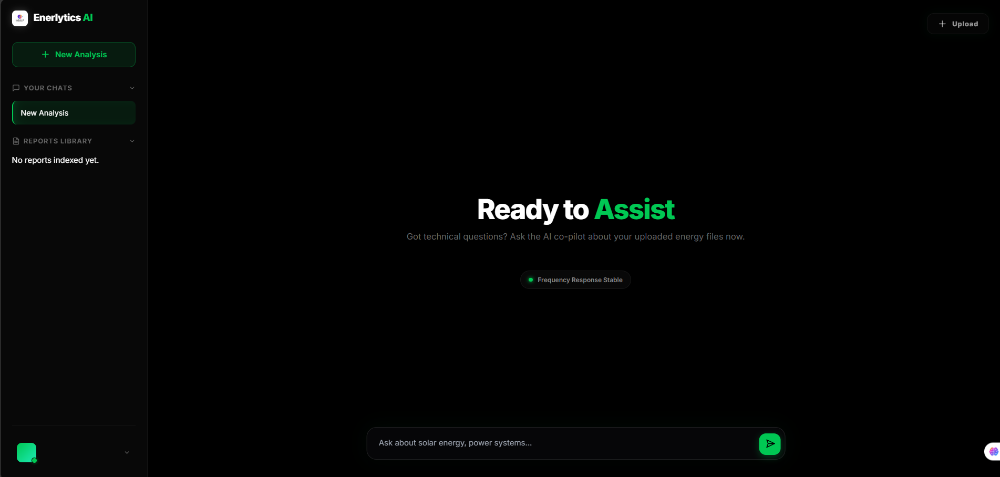
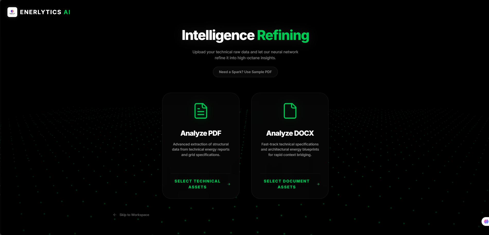
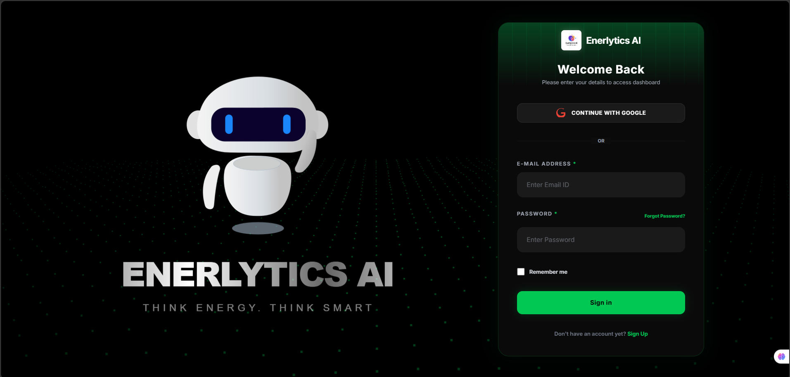
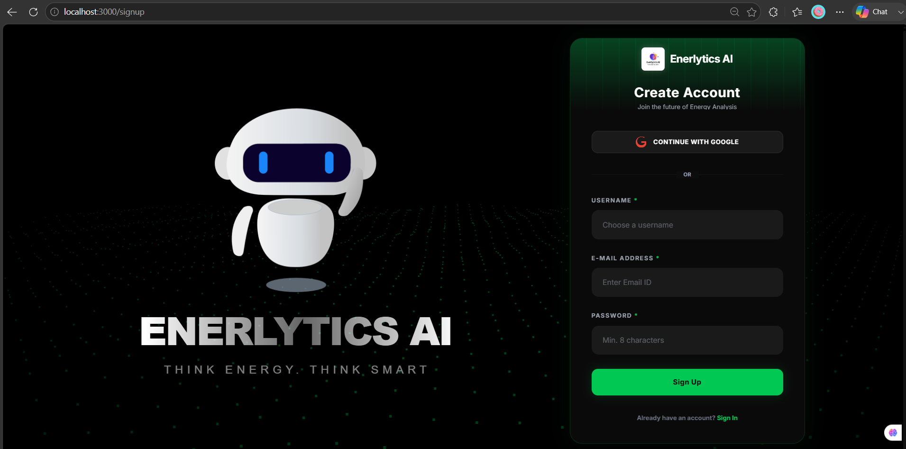
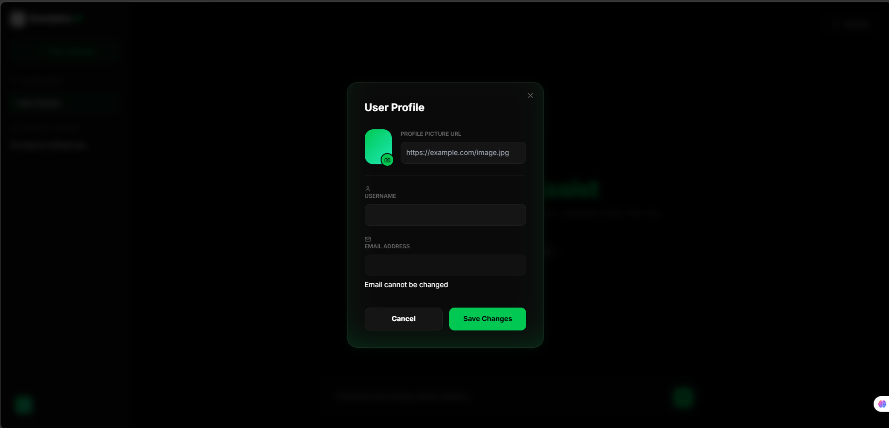

# ⚡ ENERLYTICS AI - Energy RAG Platform

> [!CAUTION]
> ⚠️ This project is proprietary. Unauthorized use is strictly prohibited. **© 2026 Pranjal Sharma**.

**Enerlytics AI** is a production-grade Retrieval-Augmented Generation (RAG) platform purpose-built for the energy sector. It allows engineers, analysts, and grid operators to upload complex technical documentation (PDF/DOCX) and interact with it via a neural-powered chat interface.

---

## 📸 Interface Preview

<p align="center">
  
  
</p>
<p align="center">
  
  
  
</p>

---

## 🛠️ Tech Stack & Architecture

This project uses a high-performance modern stack designed for speed and scalability:

- **Frontend**: `React 18`, `Vite`, `Tailwind CSS`, `Lucide Icons`.
- **Backend**: `FastAPI` (Python 3.11), `JWT Auth`, `Pydantic`.
- **AI/LLM**: `Groq` (Llama-3.1), `SentenceTransformers` (Local Embeddings), `LangChain`.
- **Database**: `Qdrant` (Vector Store), `Redis` (Chat Memory & Rate Limiting).
- **DevOps**: `Docker`, `Docker-Compose`, `Nginx` (Reverse Proxy).

---

## 🚀 Getting Started (How to Run)

If you've just cloned this repo and want to run it on your local machine, follow these steps:

### 1. Clone the Project
```bash
git clone https://github.com/your-username/energy-rag-platform.git
cd energy-rag-platform
```

### 2. Configure Environment Variables
Create a `.env` file in the root directory and add your API keys:
```bash
# AI Providers
GROQ_API_KEY_1=your_groq_key_here
VITE_GOOGLE_CLIENT_ID=your_google_id_here

# Database
QDRANT_URL=your_qdrant_cloud_url
QDRANT_API_KEY=your_qdrant_api_key
REDIS_URL=redis://redis:6379
```

### 3. Run using Docker (Recommended)
Make sure you have Docker installed and running, then execute:
```bash
docker-compose up --build
```
- **Web App**: [http://localhost:3000](http://localhost:3000)
- **API Docs**: [http://localhost:8000/docs](http://localhost:8000/docs)

---

## 💻 Manual Setup (For Development)

If you don't want to use Docker, you can run the components manually:

### Backend Setup
```bash
cd backend
python -m venv venv
./venv/Scripts/activate # On Windows use this
pip install -r requirements.txt
uvicorn main:app --reload
```
*Note: Ensure a local Redis server is running.*

### Frontend Setup
```bash
cd frontend
npm install
npm run dev
```

---

## 🚀 Key Features
- **Domain-Grounding**: Validates documents for energy-sector technical keywords.
- **Neural Trace**: View similarity scores and source chunks for every AI response.
- **Auto-Sync**: Seamless Signup -> Upload -> Chat workflow.
- **Security**: 10-day token persistence with secure HTTP-only cookies.

---
*Developed by Pranjal Sharma. Built for the future of energy intelligence.*
